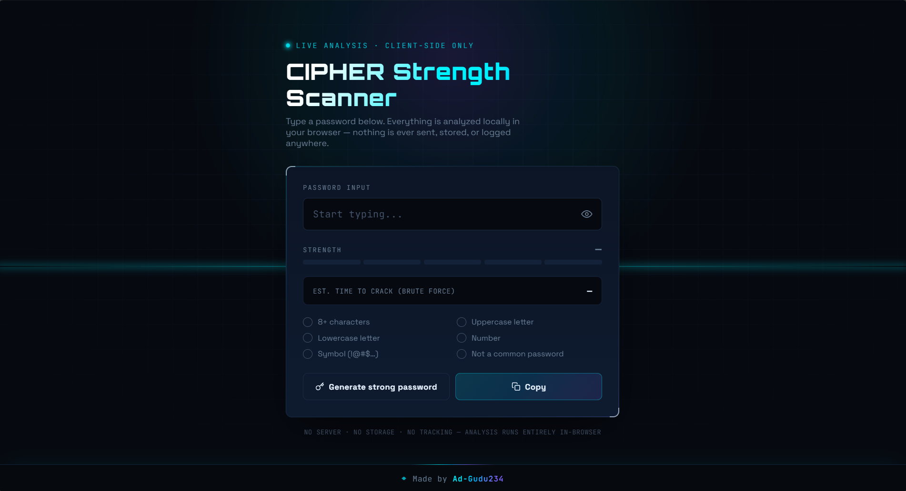

# 🔐 CIPHER // Password Strength Scanner

<p align="center">
  
</p>

<h3 align="center">
A Modern & Futuristic Password Strength Analyzer
</h3>

<p align="center">
Analyze password security instantly with a sleek cyber-themed interface.
Built with HTML, CSS, and JavaScript.
</p>

---

## 📸 Screenshot

<p align="center">
  
</p>

---

# ✨ Features

- 🔒 Real-time password strength analysis
- 📊 Dynamic password strength meter
- 🔤 Uppercase & lowercase detection
- 🔢 Number detection
- 🔣 Special character detection
- 📏 Password length validation
- ⚡ Instant security feedback
- 🖥️ Fully responsive design
- 🎨 Modern futuristic cyber UI
- 🌙 Dark theme interface
- 🔐 100% Client-side processing
- 🚀 Fast & Lightweight

---

# 🛠️ Technologies Used

- HTML5
- CSS3
- JavaScript (Vanilla)

---

# 📂 Project Structure

```
password-strength-checker/
│
├── asst/
│   └── img/
│       ├── logo.png
│       └── screenshot.png
│
├── index.html
├── style.css
├── main.js
└── README.md
```

---

# 🚀 Getting Started

### Clone the Repository

```bash
git clone https://github.com/Ad-gudu234/password-strength-checker.git
```

### Open the Project

```bash
cd password-strength-checker
```

Simply open **index.html** in your web browser.

No installation or dependencies required.

---

# 🌐 Live Demo

After enabling GitHub Pages:

**https://ad-gudu234.github.io/password-strength-checker/**

---

# 🔐 Privacy

CIPHER respects your privacy.

✅ Passwords never leave your browser.

- No server processing
- No data collection
- No tracking
- No storage
- Completely secure

---

# 🎯 Future Improvements

- Password Generator
- Password Breach Detection
- Password Entropy Score
- AI Password Suggestions
- Multi-language Support
- Light Theme
- Export Security Report
- Password History Checker

---

# 🤝 Contributing

Contributions are welcome.

1. Fork the repository
2. Create a new feature branch
3. Commit your changes
4. Push your branch
5. Open a Pull Request

---

# 📜 License

This project is licensed under the **MIT License**.

---

# 👨‍💻 Developer

**Subhrajeet Behera**

Cybersecurity Student • Web Developer • Ethical Hacking Enthusiast

GitHub:
https://github.com/Ad-gudu234

---

# ⭐ Support

If you found this project helpful, please give it a **⭐ Star** on GitHub.

It motivates future development and helps others discover the project.

---

<p align="center">
Made with ❤️ by <b>Ad-Subhrajeet Behera</b>
</p>
